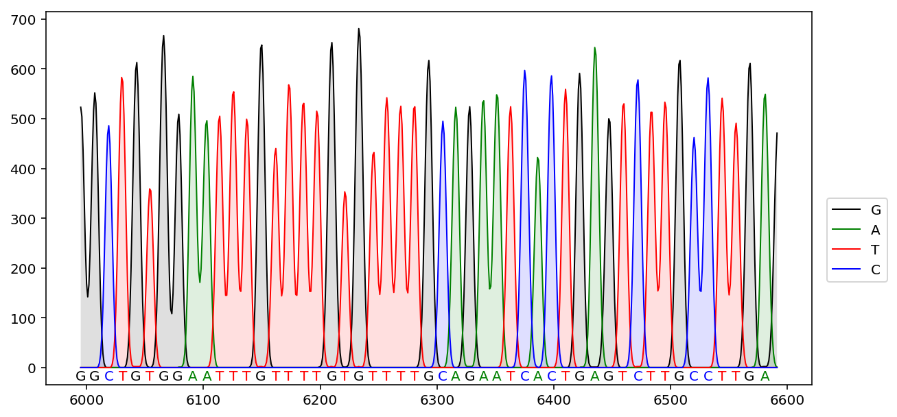

Chromatogram
-------------------
This pythoin script is used for parsing sanger sequencing results (abi file).
It's usefull to create chrmatogram when used for a paper.  

Example:  



Usage
============

```python
from chromatogram import Chromatogram
abi = Chromatogram("path/to/{filename}.abi", 
                    show_range=(50, 100), # sequence range to show in the plot
                    rev_complement=False, # show reverse complement sequence and plot
                    figsize=(10,5)
                    )
abi.plot() # set filename="chromatogram.pdf" to save your figure
abi.plot(show_range=(100,150)) # show sequence range from 100 to 150
```

Dependency
=============

+ Python
   * Biopython
   * Matplotlib

